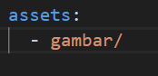

# #07 | Layout dan Navigasi

> Nama    : Syahla' Syafiqah Fayra
>
> NIM     : 2141720015
>
> Kelas   : TI - 3G

## Praktikum 4: Implementasi image section

### Langkah 1: Siapkan aset gambar
Anda dapat mencari gambar di internet yang ingin ditampilkan. Buatlah folder images di root project layout_flutter. Masukkan file gambar tersebut ke folder images, lalu set nama file tersebut ke file pubspec.yaml seperti berikut:



### Langkah 2: Tambahkan gambar ke body
Tambahkan aset gambar ke dalam body seperti berikut:
~~~
body: Column(
          children: [
            Image.asset(
              'gambar/pantai.jpg',
              width: 600,
              height: 240,
              fit: BoxFit.cover,
              ),
            titleSection,
            buttonSection,
            textSection,
            // Tambahkan widget lain di sini sesuai kebutuhan Anda
          ],
        ),
~~~

### Langkah 3: Terakhir, ubah menjadi ListView
~~~
body: ListView(
          children: [
            Image.asset(
              'gambar/pantai.jpg',
              width: 600,
              height: 240,
              fit: BoxFit.cover,
              ),
            titleSection,
            buttonSection,
            textSection,
            // Tambahkan widget lain di sini sesuai kebutuhan Anda
          ],
        ),
~~~

### Hasil Run


## Tugas Praktikum 1
### Contoh 1: Creating a Column
---


### Contoh 2: Modifying axis size
---


### Contoh 3: Modifying main axis alignment
---


### Contoh 4: Modifying cross axis alignment
---


### Contoh 5: Changing fit properties
---


### Contoh 6: Testing flex values
---


### Contoh 7: Filling extra space
---


### Contoh 8: Resizing a widget
---


### Contoh 9: Creating space
---


### Contoh 10: Creating more space
---


### Contoh 11: Aligning text
---


### Contoh 12: Creating an Icon
---


### Contoh 13: Displaying an image
---


### Latihan


## Praktikum 5: Membangun Navigasi di Flutter

### Langkah 1: Buat Project Baru
Sebelum melanjutkan praktikum, buatlah sebuah project baru Flutter dengan nama belanja dan susunan folder seperti pada gambar berikut. Penyusunan ini dimaksudkan untuk mengorganisasi kode dan widget yang lebih mudah.


### Langkah 2: Mendefinisikan Route
Buatlah dua buah file dart dengan nama home_page.dart dan item_page.dart pada folder pages. Untuk masing-masing file, deklarasikan class HomePage pada file home_page.dart dan ItemPage pada item_page.dart. Turunkan class dari StatelessWidget. Gambaran potongan kode dapat anda lihat sebagai berikut.


### Langkah 3: Lengkapi Kode di main.dart
Setelah kedua halaman telah dibuat dan didefinisikan, bukalah file main.dart. Pada langkah ini anda akan mendefinisikan Route untuk kedua halaman tersebut. Definisi penamaan route harus bersifat unique. Halaman HomePage didefinisikan sebagai /. Dan halaman ItemPage didefinisikan sebagai /item. Untuk mendefinisikan halaman awal, anda dapat menggunakan named argument initialRoute. Gambaran tahapan ini, dapat anda lihat pada potongan kode berikut.


### Langkah 4: Membuat data model
Sebelum melakukan perpindahan halaman dari HomePage ke ItemPage, dibutuhkan proses pemodelan data. Pada desain mockup, dibutuhkan dua informasi yaitu nama dan harga. Untuk menangani hal ini, buatlah sebuah file dengan nama item.dart dan letakkan pada folder models. Pada file ini didefinisikan pemodelan data yang dibutuhkan. Ilustrasi kode yang dibutuhkan, dapat anda lihat pada potongan kode berikut.


### Langkah 5: Lengkapi kode di class HomePage
Pada halaman HomePage terdapat ListView widget. Sumber data ListView diambil dari model List dari object Item. Gambaran kode yang dibutuhkan untuk melakukan definisi model dapat anda lihat sebagai berikut.


### Langkah 6: Membuat ListView dan itemBuilder
Untuk menampilkan ListView pada praktikum ini digunakan itemBuilder. Data diambil dari definisi model yang telah dibuat sebelumnya. Untuk menunjukkan batas data satu dan berikutnya digunakan widget Card. Kode yang telah umum pada bagian ini tidak ditampilkan. Gambaran kode yang dibutuhkan dapat anda lihat sebagai berikut.


### Langkah 7: Menambahkan aksi pada ListView
Item pada ListView saat ini ketika ditekan masih belum memberikan aksi tertentu. Untuk menambahkan aksi pada ListView dapat digunakan widget InkWell atau GestureDetector. Perbedaan utamanya InkWell merupakan material widget yang memberikan efek ketika ditekan. Sedangkan GestureDetector bersifat umum dan bisa juga digunakan untuk gesture lain selain sentuhan. Pada praktikum ini akan digunakan widget InkWell.

Untuk menambahkan sentuhan, letakkan cursor pada widget pembuka Card. Kemudian gunakan shortcut quick fix dari VSCode (Ctrl + . pada Windows atau Cmd + . pada MacOS). Sorot menu wrap with widget... Ubah nilai widget menjadi InkWell serta tambahkan named argument onTap yang berisi fungsi untuk berpindah ke halaman ItemPage. Ilustrasi potongan kode dapat anda lihat pada potongan berikut.


## Tugas Praktikum 2
1. Untuk melakukan pengiriman data ke halaman berikutnya, cukup menambahkan informasi arguments pada penggunaan Navigator. Perbarui kode pada bagian Navigator menjadi seperti berikut.

    

2. Pembacaan nilai yang dikirimkan pada halaman sebelumnya dapat dilakukan menggunakan ModalRoute. Tambahkan kode berikut pada blok fungsi build dalam halaman ItemPage. Setelah nilai didapatkan, anda dapat menggunakannya seperti penggunaan variabel pada umumnya. (https://docs.flutter.dev/cookbook/navigation/navigate-with-arguments)

    

3. Pada hasil akhir dari aplikasi belanja yang telah anda selesaikan, tambahkan atribut foto produk, stok, dan rating. Ubahlah tampilan menjadi GridView seperti di aplikasi marketplace pada umumnya.


4. Silakan implementasikan Hero widget pada aplikasi belanja Anda dengan mempelajari dari sumber ini: https://docs.flutter.dev/cookbook/navigation/hero-animations

5. Sesuaikan dan modifikasi tampilan sehingga menjadi aplikasi yang menarik. Selain itu, pecah widget menjadi kode yang lebih kecil. Tambahkan Nama dan NIM di footer aplikasi belanja Anda.

6. Selesaikan Praktikum Navigasi dan Rute tersebut, lalu dokumentasikan dan push ke repository Anda berupa screenshot setiap hasil pekerjaan beserta penjelasannya di file README.md. Kumpulkan link commit repository GitHub Anda ke spreadsheet yang telah disediakan!


### Jawaban 
1. Kode Program
    * Home Page 
        ```
        import 'package:belanja/models/item.dart';
        import 'package:flutter/material.dart';

        class HomePage extends StatelessWidget {
        final List<Item> items = [
            Item(
                name: 'Exist',
                price: 240000,
                image: 'assets/exist.jpg'),
            Item(
                name: 'The War',
                price: 195000,
                image: 'assets/the war.jpeg'),
            Item(
                name: 'Growl',
                price: 300000,
                image: 'assets/growl.jpg'),
            Item(
                name: 'Obsession',
                price: 200000,
                image: 'assets/obsession.png'),
            Item(
                name: 'Exodus',
                price: 250000,
                image: 'assets/exodus.png'),
            Item(
                name: 'Ex Act',
                price: 350000,
                image: 'assets/exact.jpg'),
        ];

        @override
        Widget build(BuildContext context) {
            return Scaffold(
            appBar: AppBar(
                title: const Text('Shopping List'),
                backgroundColor: Color.fromARGB(255, 191, 140, 253),

            ),
            body: GridView.builder(
                gridDelegate: const SliverGridDelegateWithFixedCrossAxisCount(
                crossAxisCount: 2, // Menampilkan 2 item per baris
                childAspectRatio: 0.7, // Mengatur rasio lebar-tinggi item
                ),
                itemCount: items.length,
                itemBuilder: (context, index) {
                final item = items[index];
                return InkWell(
                    onTap: () {
                    Navigator.pushNamed(context, '/item', arguments: item);
                    },
                    child: Card(
                    child: Padding(
                        padding: const EdgeInsets.all(
                            8), // Tambahkan padding pada keseluruhan Card
                        child: Column(
                        crossAxisAlignment: CrossAxisAlignment.start,
                        children: [
                            Hero(
                            tag: 'productImage${item.name}',
                            child: AspectRatio(
                                aspectRatio:
                                    1, // Rasio lebar-tinggi 1:1 untuk ukuran yang sama
                                child: Image.asset(item.image, fit: BoxFit.cover),
                            ),
                            ),
                            Row(
                            mainAxisAlignment: MainAxisAlignment
                                .spaceBetween, // Agar rating berada di sebelah kanan
                            children: [
                                Padding(
                                padding: const EdgeInsets.only(
                                    top: 8), // Padding di atas teks "name"
                                child: Text(
                                    item.name,
                                    style: const TextStyle(
                                    fontWeight: FontWeight.bold,
                                    fontSize: 16,
                                    ),
                                ),
                                ),
                            ],
                            ),
                            Padding(
                            padding: const EdgeInsets.symmetric(vertical: 8),
                            child: Text(
                                'Rp. ${item.price}',
                                style: const TextStyle(
                                color: Colors.pinkAccent,
                                fontSize: 14,
                                ),
                            ),
                            ),
                        ],
                        ),
                    ),
                    ),
                );
                },
            ),
            bottomNavigationBar: BottomAppBar(
                child: Container(
                padding: const EdgeInsets.all(16),
                decoration: const BoxDecoration(
                    color: Color.fromARGB(255, 191, 140, 253),
                ),
                child: const Row(
                    mainAxisAlignment: MainAxisAlignment.spaceBetween,
                    children: [
                    Text(
                        'Syahla Syafiqah Fayra',
                        style: TextStyle(
                        color: Colors.white,
                        fontSize: 16,
                        ),
                    ),
                    Text(
                        '2141720015',
                        style: TextStyle(
                        color: Colors.white,
                        fontSize: 16,
                        ),
                    ),
                    ],
                ),
                ),
            ),
            );
        }
        }
        ```
    * Item Page
        ```
        import 'package:belanja/models/item.dart';
        import 'package:flutter/material.dart';

        class ItemPage extends StatelessWidget {
        const ItemPage({super.key});

        @override
        Widget build(BuildContext context) {
            final itemArgs = ModalRoute.of(context)!.settings.arguments as Item;

            return Scaffold(
            appBar: AppBar(
                title: const Text('Item Details'),
                backgroundColor: Color.fromARGB(255, 191, 140, 253),

            ),
            body: Padding(
                padding: const EdgeInsets.all(16.0),
                child: Column(
                crossAxisAlignment: CrossAxisAlignment.start,
                children: [
                    Hero(
                    tag: 'productImage${itemArgs.name}',
                    child: Image.asset(itemArgs.image),
                    ),
                    const SizedBox(
                        height: 16), // Tambahkan jarak antara gambar dan teks
                    Row(
                    mainAxisAlignment: MainAxisAlignment.spaceBetween,
                    children: [
                        Text(
                        '${itemArgs.name}',
                        style: const TextStyle(
                            fontWeight: FontWeight.bold,
                            fontSize: 24,
                        ),
                        ),
                    ],
                    ),
                    const SizedBox(height: 8), // Tambahkan jarak antara nama dan harga
                    Row(
                    mainAxisAlignment: MainAxisAlignment.spaceBetween,
                    children: [
                        Text(
                        'Rp. ${itemArgs.price}',
                        style: const TextStyle(
                            color: Colors.pinkAccent,
                            fontSize: 20,
                        ),
                        ),
                    ],
                    ),
                ],
                ),
            ),
            );
        }
        }
        ```
    * Main
        ```
        import 'package:belanja/pages/home_page.dart';
        import 'package:belanja/pages/item_page.dart';
        import 'package:flutter/material.dart';

        void main() {
        runApp(MaterialApp(
            debugShowCheckedModeBanner: false,
            initialRoute: '/',
            routes: {
            '/': (context) => HomePage(),
            '/item': (context) => const ItemPage(),
            },
        ));
        }
        ```
2. Hasil Program

    <table>
    <tr>
        <th>Home page</th>
        <th>Item Page</th>
    </tr>
    <tr>
        <th></th>
        <th></th>
    </tr>
    </table>